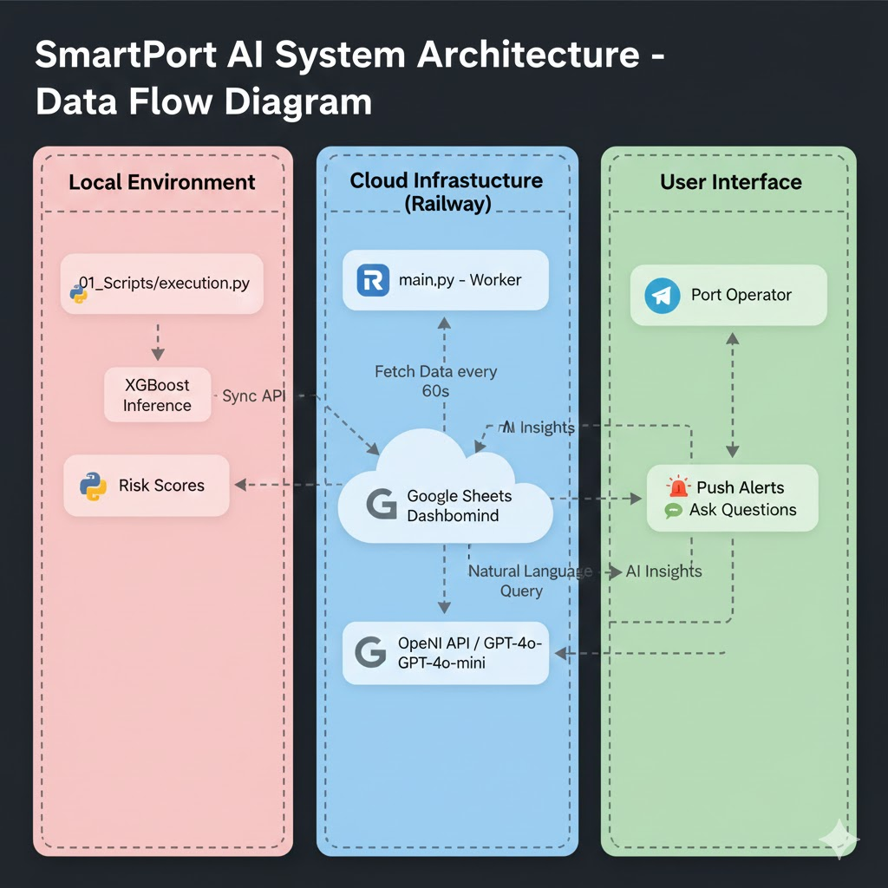

# 🚢 SmartPort AI: Real-Time Maritime Delay Prediction & Management

SmartPort AI is an end-to-end data engineering and machine learning solution designed to predict and manage vessel delays in busy port environments. It combines a **Gradient Boosting (XGBoost)** model with a cloud-based audit system and an **AI-driven Assistant** that provides real-time notifications and natural language data analysis via Telegram.

The system transforms raw AIS data into actionable maritime intelligence, identifying high-risk vessels 24/7 through a cloud-native infrastructure.

## 🎯 Project Focus & Business Logic
The core objective is to identify vessels that will exceed the **120-minute (2-hour) delay threshold**, which is the critical "berthing window" in port logistics.

* **Target:** Predict delays > 120 minutes.
* **Actionability:** Automated risk categorization to assist port operators in real-time decision-making.
* **Architecture:** A seamless pipeline from local ML execution to Google Cloud storage and a **Cloud-Native Telegram Bot (Railway)** with OpenAI integration.

## 🏗️ Technical Architecture

The system is built as a unified ecosystem where data flows through three distinct layers:

1.  **ML Engine:** XGBoost model trained on engineered AIS features (speed delta, movement stability, heading changes).
2.  **Cloud Data Warehouse:** Google Sheets API serves as a real-time audit log and operational dashboard.
3.  **Command & Control (Cloud Ready):** A Python-based worker deployed on **Railway** using a Telegram interface. It integrates **OpenAI (GPT-4o-mini)** to provide natural language insights over the maritime data.

---

## 🚀 Key Components

### 1. Machine Learning Execution (`execution.py`)
The pipeline processes AIS datasets, extracting features and running them through the trained model.
* **Probability Scoring:** Outputs a `risk_score` (0 to 1).
* **Decision Map:**
    * **CRITICAL (> 0.8):** Immediate intervention (e.g., Reassign docking slot).
    * **WARNING (0.5 - 0.8):** Proactive monitoring of GPS/ETA updates.
    * **NORMAL (< 0.5):** Routine operations.

### 2. Strategic Cloud Dashboard (Google Sheets)
The system syncs a strategic operational sample to the cloud:
* **Strategic Focus:** Synchronizes top 'CRITICAL' and 'WARNING' cases for immediate action.
* **Audit Integrity:** Every entry uses a unique `prediction_id` (SHA-256 hash) to ensure data lineage.

### 3. AI-Powered Telegram Interface (`main.py`)
Deployed 24/7 on Railway, the bot acts as the central hub for the port operator:
* **Proactive Monitoring:** An automated **Watchman** service scans the dashboard every 60 seconds and pushes alerts for new critical risks.
* **Intelligent Analyst:** Powered by OpenAI, the operator can ask complex questions like *"Who is at risk and what should I do?"* in both English and Spanish.
* **Notification Fatigue Control:** Implements a consolidated alerting system to prevent spamming the operator.

---

## 📊 Dashboard Structure
The Google Sheets dashboard is organized for high-speed decision-making:

| Column | Description |
| :--- | :--- |
| `prediction_id` | Unique alphanumeric hash for audit tracking. |
| `timestamp` | Exact execution time of the ML prediction. |
| `vessel_id` | Original vessel identifier from the ML process. |
| `risk_score` | Confidence level of the XGBoost model. |
| `risk_level` | Executive category (CRITICAL, WARNING, NORMAL). |
| `action` | Recommended business action based on the Decision Map. |

---

## 🛠️ Setup & Deployment
1.  **ML Inference:** Run `python execution.py` to generate new predictions and sync to Google Sheets.
2.  **Cloud Hosting:** Deployed on **Railway** as a Worker process.
3.  **Environment Variables:** Securely managed via Railway (OpenAI Key, Telegram Token, Google Credentials JSON).

## 📈 Future Roadmap
* **Live AIS Integration:** Connecting the pipeline to a real-time AIS stream for true 24/7 monitoring.
* **Economic Impact Scaling:** Integrating cargo value to calculate the financial loss per minute of delay.

---
Developed by Roberto Fernández - 2025. Specialized in AI Operations and Maritime Logistics.