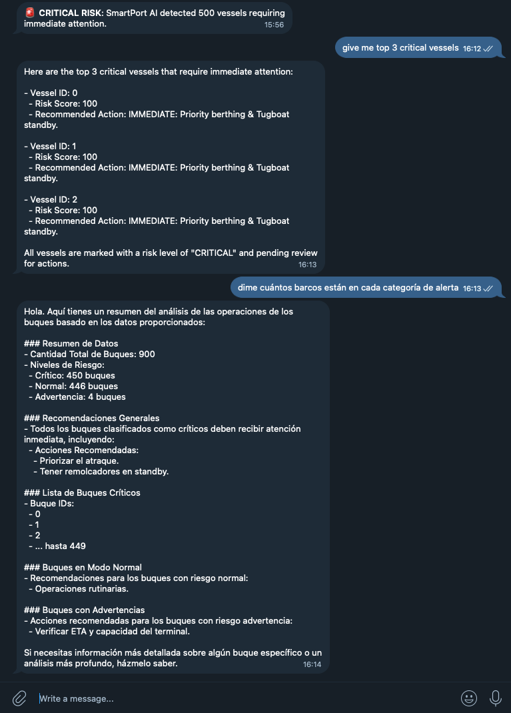

# 🚢 SmartPort AI: Real-Time Maritime Risk Monitoring
**Predictive Intelligence for Port Operations & Vessel Delay Prevention**

SmartPort AI is an end-to-end **maritime risk intelligence system** designed to predict, monitor, and act on vessel delays in congested port environments. 

It transforms raw AIS (Automatic Identification System) movement data into **actionable operational alerts**, identifying vessels at risk of exceeding the **critical 120-minute berthing delay window**, delivering insights via a cloud-based dashboard and an AI-powered Telegram assistant.

Raw data: https://www.kaggle.com/datasets/bobaaayoung/container-ship-data-collection?utm_source=chatgpt.com&select=tracking_db.csv

---

## 🎯 Project Purpose & Business Logic

Port operations rely on tight berthing windows. Delays beyond **120 minutes** have cascading economic impacts on the entire supply chain.

**SmartPort AI exists to answer one critical question:**
> *"Which vessels are likely to exceed the 120-minute delay threshold, and what is the prioritized operational response?"*

### Core Objectives
- **Predict** vessel delays exceeding 120 minutes using Machine Learning.
- **Categorize Risk** automatically (Critical / Warning / Normal).
- **Notify Operators** in real-time to enable proactive decision-making.
- **Provide Explainable Insights** through an AI Analyst.

---

## 🏗️ Architecture Overview

SmartPort AI is built as a three-layer ecosystem:

### 1. ML Prediction Engine (XGBoost)
* **Feature Engineering:** Processes movement-based features such as speed stability, heading variance, and historical congestion patterns.
* **Inference:** Runs an **XGBoost model** trained to classify delay probability.
* **Output:** Generates a `risk_score` (0-1) and a recommended operational action per vessel.

### 2. Cloud Audit & Operational Dashboard (Google Sheets)
* **Single Source of Truth:** Uses Google Sheets as a lightweight cloud data warehouse for immediate operational visibility.
* **Data Integrity:** Every prediction is logged with a unique **SHA-256 hash (`prediction_id`)**, ensuring full traceability and preventing duplicate entries in the audit trail.

### 3. Command & Control: AI-Powered Telegram Bot
* **Proactive Watchman:** Scans the dashboard every 60 seconds to detect new **CRITICAL** risk entries and push instant alerts.
* **Intelligent Analyst:** Powered by **OpenAI GPT-4o-mini**, allowing operators to query the port's state using natural language (e.g., *"What are my priority actions for the next 4 hours?"*).

---

## 🚦 Risk Classification Logic

Each prediction follows a standardized decision matrix to ensure trust and consistency:

| Risk Level | Score Range | Operational Meaning | Suggested Action |
|:--- | :--- | :--- | :--- |
| **CRITICAL** | > 0.80 | High likelihood of >120 min delay | Immediate intervention (reassign berth) |
| **WARNING** | 0.50 – 0.80 | Elevated risk | Monitor ETA and AIS stability closely |
| **NORMAL** | < 0.50 | Low risk | Routine operations |

---

## 📊 Dashboard Schema

The system maintains an auditable log with the following structure:

| Column | Description |
| :--- | :--- |
| `prediction_id` | Unique SHA-256 hash for traceability. |
| `timestamp` | Exact execution time of the prediction. |
| `vessel_id` | Unique identifier for the vessel (from AIS). |
| `risk_score` | Model confidence (0.0 to 1.0). |
| `risk_level` | Categorization (CRITICAL / WARNING / NORMAL). |
| `action` | Recommended operational response. |

---

## 🛠️ Tech Stack

* **Machine Learning:** Python, XGBoost, Scikit-learn, Pandas.
* **Cloud & API:** Google Sheets API (gspread), OpenAI API.
* **Interface:** Telegram Bot API (python-telegram-bot).
* **Security:** SHA-256 Hashing, Environment Variables (`.env`).